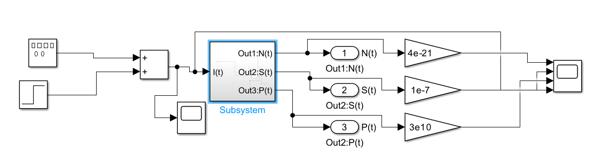
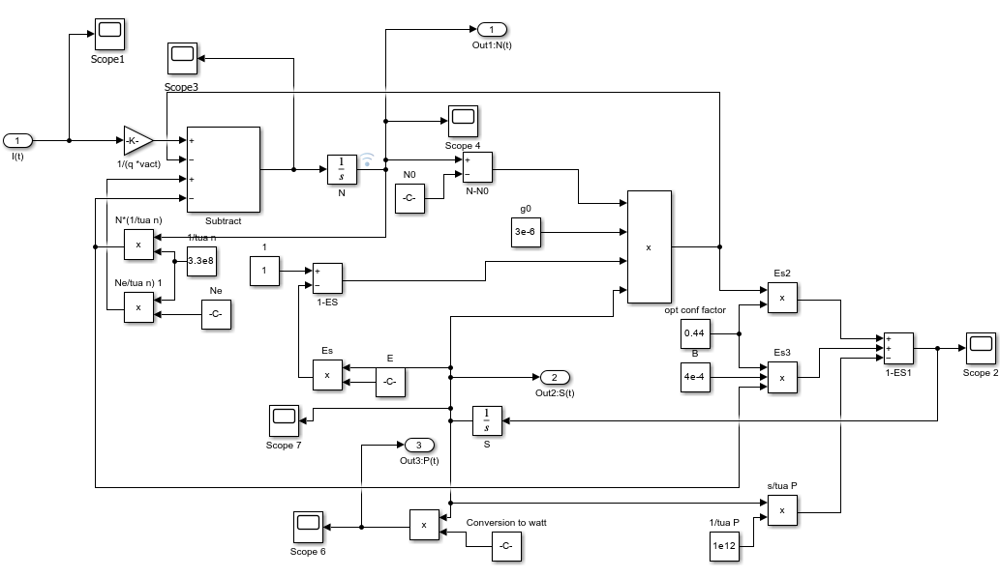
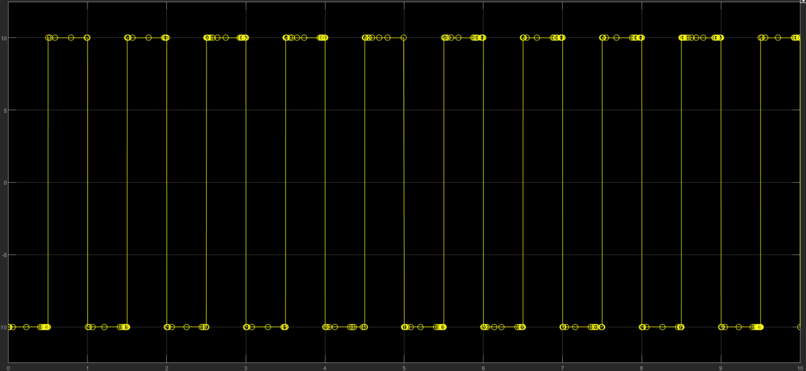
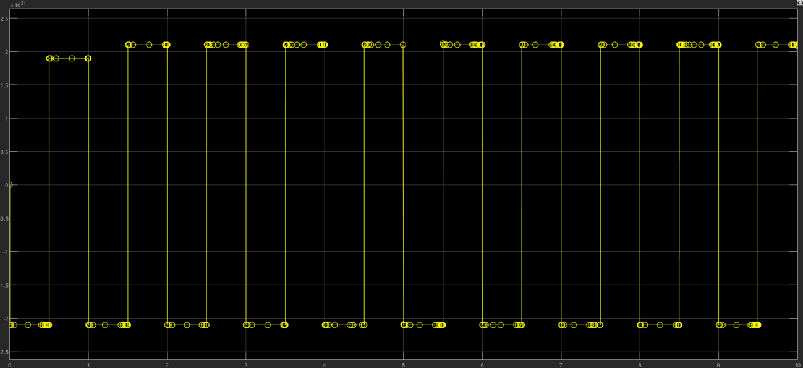
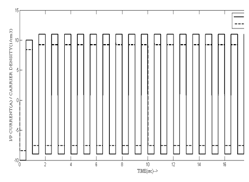
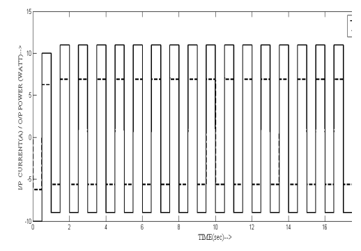
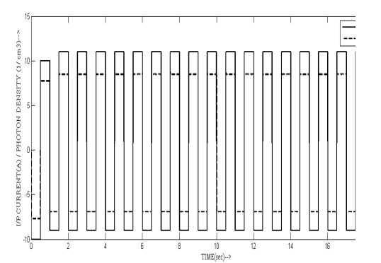
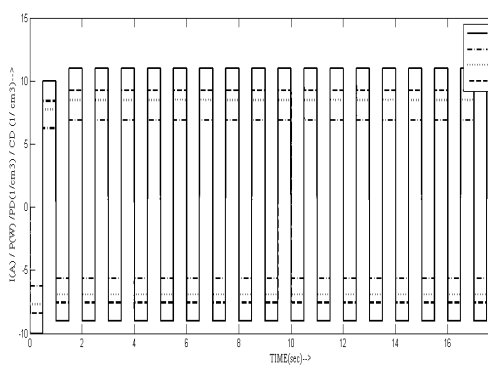
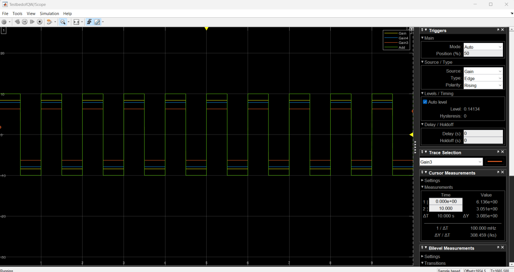

# MATLAB/Simulink Test Bed of a Quantum-Well (QW) Laser for Optical Communication Systems

**Type:** Rate-equation-based behavioral model
**Tools:** MATLAB Simulink, variable-step solver `ode23t`
**Domain:** Semiconductor laser dynamics / optical communication front-end

## 1. Objective

This project implements the standard single-mode **carrier–photon rate-equation model** of a quantum-well (QW) laser diode in Simulink, and drives it with a pulsed injection-current source to observe the resulting carrier density `N(t)`, photon density `S(t)`, and optical output power `P(t)`. The goal is to validate that the Simulink block realization reproduces the expected qualitative behavior of a directly-modulated laser used as the optical source in a communication link.

## 2. Model Architecture

**Top-level model** — a step/pulse current source feeds the QW-laser subsystem; the three outputs are scaled and sent to a common scope for side-by-side comparison with the input:



**QW-laser subsystem** — implements the two coupled rate equations directly as block-diagram arithmetic (gain block, integrators, and feedback subtraction for the `(N − N₀)` and `(1 − εS)` nonlinear terms):



## 3. Governing Equations

### 3.1 Carrier density rate equation

$$
\frac{dN(t)}{dt} = \frac{I(t)}{qV_{act}} - g_0\big(N(t)-N_0\big)\big(1-\epsilon S(t)\big)S(t) - \frac{N(t)}{\tau_n} + \frac{N_e}{\tau_n}
$$

| Term | Physical meaning |
|---|---|
| $I(t)/qV_{act}$ | Carrier injection rate from the drive current |
| $g_0(N-N_0)(1-\epsilon S)S$ | Carrier loss via stimulated emission, with gain-compression factor $\epsilon$ |
| $-N/\tau_n + N_e/\tau_n$ | Net spontaneous/non-radiative recombination, written as $-(N-N_e)/\tau_n$ |

### 3.2 Photon density rate equation

$$
\frac{dS(t)}{dt} = \Gamma g_0\big(N(t)-N_0\big)\big(1-\epsilon S(t)\big)S(t) + \frac{\Gamma\beta N(t)}{\tau_n} - \frac{S(t)}{\tau_p}
$$

| Term | Physical meaning |
|---|---|
| $\Gamma g_0(N-N_0)(1-\epsilon S)S$ | Stimulated-emission gain into the lasing mode, scaled by the confinement factor $\Gamma$ |
| $\Gamma\beta N/\tau_n$ | Spontaneous emission coupled into the lasing mode |
| $-S/\tau_p$ | Photon loss (cavity/mirror losses) with photon lifetime $\tau_p$ |

Optical output power `P(t)` is obtained from `S(t)` via the "Conversion to Watt" gain block (uses $\eta$, $h$, $c$, $\lambda_0$).

### 3.3 Parameters used

| Symbol | Description | Value | Unit |
|---|---|---|---|
| $Q$ | Electronic charge | 1.602e-19 | C |
| $V_{act}$ | Active region volume | 9e-11 | cm³ |
| $g_0$ | Gain coefficient | 3e-6 | cm³/s |
| $N_0$ | Carrier density at transparency | 1.2e18 | 1/cm³ |
| $\epsilon$ | Gain compression factor | 3.4e-17 | cm³ |
| $N_e$ | Equilibrium carrier density | 5.41e10 | 1/cm³ |
| $\tau_n$ | Carrier lifetime | 3e-9 | s |
| $\Gamma$ | Optical confinement factor | 0.44 | – |
| $\beta$ | Spontaneous emission coupling factor | 4e-4 | – |
| $\tau_p$ | Photon lifetime | 1e-12 | s |
| $\eta$ | Differential quantum efficiency | 0.1 | – |
| $h$ | Planck's constant | 6.624e-34 | J·s |
| $c$ | Speed of light | 3e8 | m/s |
| $\lambda_0$ | Lasing wavelength | 1.55e-6 | m |

$\lambda_0 = 1.55\ \mu m$ places the device in the telecom C-band, consistent with an optical-communication source.

## 4. Simulation Results

### 4.1 Input drive current
A pulsed current stimulus (superposition of a step and a repeating pulse) is applied at `I(t)`:



### 4.2 Carrier density response `N(t)`
The carrier density follows the injection pulses and settles at two quasi-steady levels, as expected for gain clamping above threshold:



### 4.3 Comparative traces (solver: `ode23t`)
Input current is overlaid (scaled) against each state variable to check timing and shape correlation:

**Current vs. Carrier Density**


**Current vs. Optical Output Power**


**Current vs. Photon Density**


**All signals overlaid**


**Raw scope capture (Simulink Scope), all four traces**


Trace legend: **yellow** = input current, **blue** = carrier density, **red** = photon density, **orange** = optical output power.

All three outputs switch synchronously with the drive current with no visible instability or divergence over 17 s of simulated time, which is the basic sanity check for this kind of testbed.

## 5. Verification Notes — is the model correct?

Checked against the standard single-mode laser rate-equation formulation (e.g., Coldren & Corzine / Agrawal form: $\dot N = I/qV - v_g g(N,S)S - N/\tau_n$, $\dot S = \Gamma v_g g(N,S)S + \Gamma\beta N/\tau_n - S/\tau_p$):

- **Structure:** ✅ Both equations match the standard form. The linearized-gain-with-compression term $g_0(N-N_0)(1-\epsilon S)S$ is a standard approximation for $v_g g(N,S)$, and the spontaneous-emission and cavity-loss terms are correctly placed.
- **Dimensional consistency:** ✅ Every term reduces to cm⁻³·s⁻¹ as required, given the stated units of $g_0$, $N_0$, $\epsilon$, $\tau_n$, $\tau_p$.
- **Parameter values:** ✅ All values (gain coefficient, transparency density, confinement factor, spontaneous emission factor, C-band wavelength) are physically reasonable for a QW laser diode.
- **One inconsistency to fix before publishing:** the carrier equation as transcribed uses the symbol **$N_c$** in the "+$N_c/\tau_n$" recombination-offset term, but the parameter table and the Simulink block (`Ne/tau_n`) both use **$N_e$** (Equilibrium Carrier Density) for the same quantity. This is almost certainly the same variable under two names — the equation should read $-(N-N_e)/\tau_n$, not $N_c$. I've used $N_e$ consistently throughout this report; you may want to correct the symbol in your own notes/slides before sharing.

Net assessment: the physics and the block-diagram implementation are correct; the only issue found is that one symbol ($N_c$ vs. $N_e$) is inconsistent between the equation text and the parameter table/model, which is a documentation/typo fix rather than a modeling error.

## 6. Repository Structure

```
.
├── README.md
└── assets/
    ├── 01_top_level_model.png
    ├── 02_rate_equation_subsystem.png
    ├── 03_input_current_waveform.png
    ├── 04_carrier_density_output.png
    ├── 05_current_vs_carrier_density.png
    ├── 06_current_vs_output_power.png
    ├── 07_current_vs_photon_density.png
    ├── 08_all_signals_overlay.png
    └── 09_scope_capture_all_traces.png
```

## 7. Suggested Next Steps

- Fix the $N_c$/$N_e$ labeling inconsistency noted above.
- Add the explicit expression used for the `Conversion to Watt` block (optical output power vs. photon density), since it's implemented in Simulink but not shown as an equation here.
- Report threshold current and L–I slope efficiency extracted from the steady-state levels of `P(t)` vs. `I(t)`, which would make the validation more quantitative than "shapes track visually."
